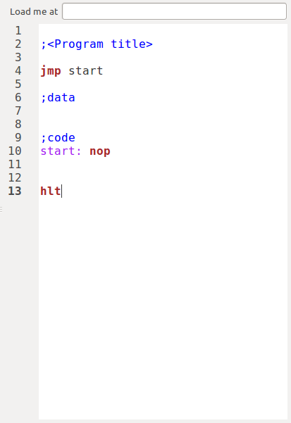
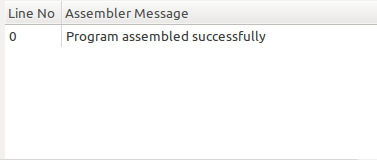
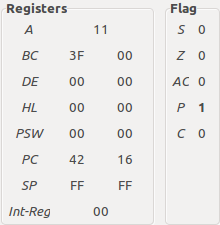
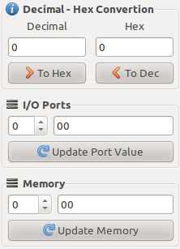
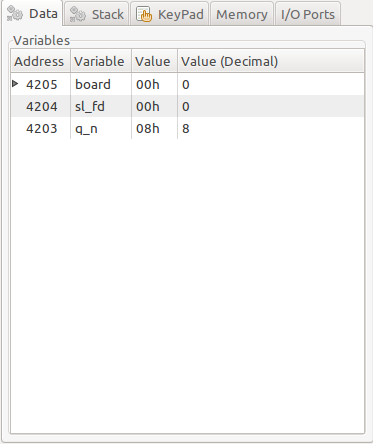
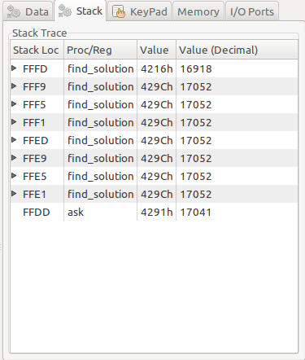
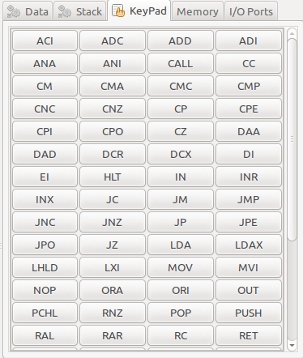
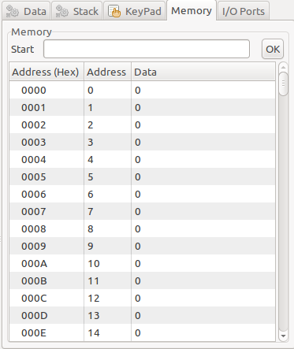
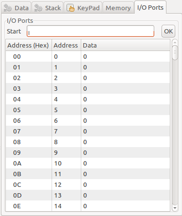
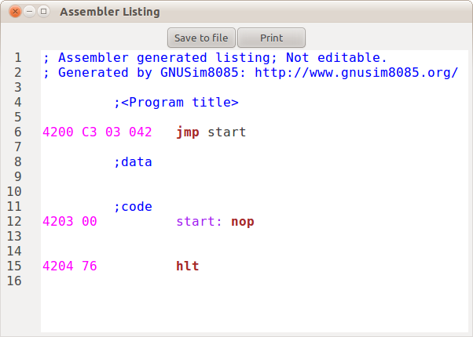

## GNUSim8085 User Guide

Copyright 2018 Onkar Shinde  
Permission is granted to copy, distribute and/or modify this document under the terms of the Creative Commons Attribution ShareAlike license, version 3.0. A summary of the license can be found at [https://creativecommons.org/licenses/by-sa/3.0/](https://creativecommons.org/licenses/by-sa/3.0/). Full text of the license can be found at [https://creativecommons.org/licenses/by-sa/3.0/legalcode](https://creativecommons.org/licenses/by-sa/3.0/legalcode)

---

## Introduction
GNUSim8085 was originally written by Sridhar Ratnakumar in year 2003 when he realized that no proper simulators existed for Linux. Since then it has been improved with features/fixes and ported to Windows thanks to help of various minds that are inclined to share knowledge.

### Features
GNUSim8085 makes it easy to learn the assembly language programming by providing an easy to use user interface. The application currently has following features.

  * Program editor with interactive input wizard for the standard instructions
  * Syntax highlighting in editor to distinguish between instructions, operands, comments etc.
  * Support for standard instructions of the 8085
  * Support for popular assembler directives
  * Complete view of registers and flags
  * Programming debugging using breakpoints or with step by step execution
  * Easy inspection of stack and source code variables defined
  * Easy inspection and manipulation of memory and I/O ports
  * Printing of program from editor as well as assembled hex code (known not to work well in Windows)

## User Interface
The user interface of GNUSim8085 consists of following components currently.

  * Program Editor  
      
      
    User can create new or edit existing program in editor. The editor has syntax highlighting to distinguish between between instructions, operands, comments etc. The ‘Load me at’ input allows specifying the start address of the assembled program.  
    
  * Assembler Messages  
      
      
    When program is assembled the status or any error messages are displayed in this section. When user clicks on any error message the editor highlights corresponding line.  
    
  * Registers and Flags  
      
      
    Values in various registers are displayed here. Also the status of flags such as carry flag is displayed.  
    
  * Data conversion and access  
      
      
    User can easily convert data between decimal and hexadecimal format. The I/O ports and memory contents can be accessed by specifying the address. To update the contents enter new value and click appropriate update button.  
    
  * Data details  
      
      
    This tab lets you inspect values of various variables defined in the program.  
    
  * Stack details  
      
      
    This tab lets you inspect values at various stack locations.  
    
  * Keypad  
      
      
    Keypad provides easy way to insert assembly instructions in case the syntax of an instruction is not known.  
    
  * Memory details  
      
      
    This tab provides easy access to the memory contents. By default only first 1000 locations are shown. To see next locations, enter address in ‘Start’ text box and press ‘OK’ button.  
    
  * I/O details  
      
      
    This tab provides easy access to the I/O contents. User can also manipulate the values by simply editing the cell contents.  
    
  * Toolbar  
      
      
    Toolbar provides quick access to various actions such as open/save/print program, assemble/execute program, debugging actions etc.  
    
  * Assembler Listing  
      
      
    The assembler listing window (accessed through menu Assembler -> Show listing) provides the hexadecimal opcodes of the program. These opcodes can be used to run the program on actual hardware.
